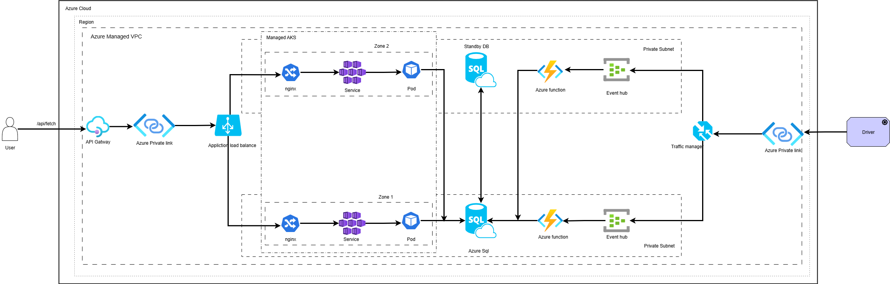

## Exercise 1 – CI/CD Pipeline Overview

This section demonstrates the implementation and results of a Continuous Integration (CI) pipeline using GitHub Actions.

### 1.1. CI Pipeline Architecture

_Figure 1: High-level CI pipeline architecture._

### 1.2. Pipeline Execution

The following images show a sample pipeline run and its result:

_Figure 2: Example of a pipeline run in GitHub Actions._

_Figure 3: Successful pipeline result._

### 1.3. Configuration and References

- [CI configuration file](.github/workflows/ci.yaml)
- [GitHub Actions pipeline runs](https://github.com/divyakumar95/eaton/actions)

---

## Exercise 2

# High-Level Architecture Document

**Acronyms:**

- **HA**: High Availability
- **DR**: Disaster Recovery
- **RTO**: Recovery Time Objective
- **RPO**: Recovery Point Objective
- **AKS**: Azure Kubernetes Service

# High-Level Design (HLD): Critical Telemetry System

This HLD analyzes two Azure architectural approaches for an **Industrial Telemetry and Critical Event Notification System**. The core function is to ingest voltage and current readings every second, **store only events exceeding a critical voltage threshold**, notify downstream systems, and use the data for analytics purpose.

## 1. Project Context and Zone Definitions

| Zone       | Role                                                                                        |
| :--------- | :------------------------------------------------------------------------------------------ |
| **Zone 1** | **Production (Prod)**: Active compute, primary data write location, and primary processing. |
| **Zone 2** | **Disaster Recovery (DR) / Standby**: Warm/Hot standby components for failover.             |

---

## 2. Approach 1: Relational & Serverless (Azure SQL / Azure Function)

**Figure 1:** High-level architecture showing Azure services and zonal deployment.

This approach leverages a traditional **relational database (Azure SQL)** with **serverless event processing (Azure Functions)** for high availability and strong data integrity.

### 2.1. Critical Event Data Flow

1.  **Ingestion:** The **Driver** sends readings (1/sec) via **API Gateway** and **Private Link** to the **AKS Pod** (Zone 1/2).
2.  **Filtering/Persistence:** The **Pod** implements the critical voltage threshold logic. **IF Voltage > Threshold**, the critical event is written to the **Azure SQL** database in **Zone 1 (Primary)**.
3.  **DR/HA:** Critical data is asynchronously replicated to the **Standby DB** in **Zone 2**.
4.  **Notification:** The **Azure Function** (triggered by the DB write) formats the critical event and pushes to the **Azure SQL**.
5.  **ingress:** The event notification is securely sent via **Traffic Manager** and **Private Link** to the downstream **Driver** / analysis system.

### 2.2. Design Factors Analysis

| Factor            | Implementation Summary                                                                                                                                                                                               |
| :---------------- | :------------------------------------------------------------------------------------------------------------------------------------------------------------------------------------------------------------------- |
| **Cost**          | **Good Control.** Azure Functions use the **Consumption Plan** (pay-per-execution), which is highly cost-effective for event processing. Main cost is the **SQL Service Tier** and its dedicated Standby DR replica. |
| **Security**      | **High.** Uses **Azure Private Link** for all external traffic. Azure SQL provides mature, enterprise-grade data security (TDE, auditing). Serverless components are isolated in a **Private Subnet**.               |
| **Observability** | Focus on **Resource Health** (DTUs/vCores) and **Execution Logs**. Requires monitoring for AKS Pod health, **Azure Function execution success**, and **SQL replication lag** between zones.                          |

---

## 3. Approach 2: NoSQL & Real-time Stream (Cosmos DB / Stream Analytics)

**Figure 2:** Alternative architecture approach for comparison.

This approach shifts to an **Active/Active NoSQL database (Cosmos DB)** and dedicated **stream processing (Stream Analytics)**.

### 3.1. Alternate Flow and Key Insights

1.  **Persistence:** The **Pod** writes critical events to **Cosmos DB**, which is natively **Active/Active** across zones.
2.  **Processing:** **Stream Analytics** reads the **Cosmos DB Change Feed**. This enables **immediate, complex transformation and aggregation** of the critical events (e.g., calculating the rate of critical occurrences).
3.  **Messaging:** The architecture utilizes external **messaging stack** (Kafka), which increases operational overhead and requires expertise in technologies.

The table below compares the key design factors for Approach 2 and how they differ from Approach 1:

### 3.2. Alternate Design Factor Comparison

| Factor            | Implementation Summary                                                                                                                                              | Comparison to Approach 1                                                                                       |
| :---------------- | :------------------------------------------------------------------------------------------------------------------------------------------------------------------ | :------------------------------------------------------------------------------------------------------------- |
| **Cost**          | **High Baseline.** High fixed hourly costs for **Stream Analytics Stream Units (SUs)** and 24/7 provisioning of **Cosmos DB Request Units (RUs)**.                  | **Higher OpEx.** Only justified by massive, variable throughput and complexity of required real-time analysis. |
| **Security**      | **High.** Similar network security (Private Link/Subnets). Management focus shifts to securing **Cosmos DB keys/tokens** and the identity used by Stream Analytics. | **Equivalent Security** (different management focus).                                                          |
| **Observability** | Focus on **Throughput and Utilization.** Requires meticulous monitoring of **RU consumption** (to prevent throttling) and **SU utilization** (to manage latency).   | **More Complex.** Higher number of specialized services and metrics to track.                                  |

---

## 4. Final Conclusion and Recommendation

The final decision hinges on balancing **Cost Control** against requirements for **Global Scale** and **Real-Time Analytics**.

The following table summarizes the recommended architecture for different business requirements:

### Final Decision Summary

| Recommendation         | Architecture                                  | Justification                                                                                                                                                                                 |
| :--------------------- | :-------------------------------------------- | :-------------------------------------------------------------------------------------------------------------------------------------------------------------------------------------------- |
| **DEFAULT CHOICE**     | **Approach 1 (Azure SQL / Azure Function)**   | Best balance of **Cost-Efficiency, Reliability, and Simplicity**. Ideal for regional, HA systems where critical data requires strong transactional integrity for later analysis.              |
| **SPECIALIZED CHOICE** | **Approach 2 (Cosmos DB / Stream Analytics)** | Necessary only for extreme requirements like **Global Latency** (multi-region scale), **massive write throughput**, or **mandatory, complex real-time stream processing** of critical events. |

**Final Takeaway:** For a telemetry system focused on **storing filtered critical data for later user analysis**, **Approach 1 is the most appropriate and cost-effective solution.**

---

## 5. References

- [Azure Architecture Center](https://learn.microsoft.com/en-us/azure/architecture/)
- [Azure Pricing Calculator](https://azure.microsoft.com/en-us/pricing/calculator/)

---

**Summary:**

**In summary, Approach 1 (Azure SQL / Azure Function) is strongly recommended for most enterprise workloads due to its cost-efficiency, operational simplicity, and reliability.** Approach 2 (Cosmos DB / Stream Analytics) should only be considered for specialized, high-scale, or real-time global scenarios where its unique capabilities are required.

If business needs evolve to require global scale, extremely high throughput, or advanced real-time analytics, revisit Approach 2 to leverage its unique capabilities.
